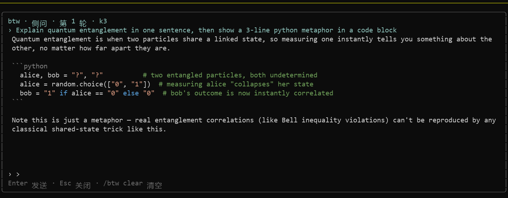

# tangzy-btw

[](LICENSE)
[](https://pi.dev/packages)
[](extensions/tangzy-btw/lib.test.ts)



A KimiCode-style `/btw` side-question extension for [pi](https://github.com/earendil-works/pi-coding-agent). Ask a quick side question without interrupting your main session — the answer arrives in a bottom overlay panel with full markdown rendering, and nothing ever touches your main transcript.

## Why

Most `/btw` implementations either take over the whole terminal (and occasionally freeze the main TUI on exit) or render answers as plain text. `tangzy-btw` was built to keep three guarantees:

- **No terminal takeover** — the panel is a bottom-anchored overlay (`ctx.ui.custom({ overlay: true })`), so the main TUI is never suspended and cannot be left frozen.
- **Markdown rendering** — answers render with pi's own `Markdown` component, not raw text.
- **Multi-turn follow-ups in-panel** — an IME-friendly input box inside the panel lets you keep asking without leaving the overlay.

Design inspired by KimiCode's side-question feature ([MoonshotAI/kimi-cli PR #1743](https://github.com/MoonshotAI/kimi-cli/pull/1743)).

## Features

- `/btw <question>` — open the panel and ask; the answer arrives in one shot, rendered with pi's own `Markdown` component (padding, trimming, and unclosed-fence repair included)
- Follow-up questions from the panel's own input (side-thread history is kept as context)
- Read-only snapshot of your main session (branch messages packed under a ~20k token budget) so the side answer knows what you're working on
- **Never pollutes the main transcript** — the side thread lives in process memory only and is gone on exit
- `/btw clear` — wipe the current conversation
- **Multiple side conversations** — `/btw new` starts a fresh one, `/btw history` lists them with model-generated titles, and `Ctrl+←`/`Ctrl+→` cycles inside the panel. Switching back opens the conversation at the top for review
- **Answers land at their beginning**, not pinned to the bottom — humans read top-down. Each answer also ends with a `> Recap:` one-liner
- **Bilingual UI (English/中文)** — auto-detected from `LANG`/`LC_ALL` (default English, matching pi itself); `/btw lang zh|en|auto` overrides and persists to `~/.pi/agent/tangzy-btw.json`. Answers follow the question's language automatically
- `Esc` closes the panel (aborting any in-flight answer); `↑`/`↓` (and PgUp/PgDn) scroll long answers
- Live waiting indicator (elapsed seconds, `Esc` to abort) while the model thinks — the panel never looks frozen. Answers are delivered one-shot rather than token-streamed, by design: with reasoning models the stream arrives as one burst anyway
- Pure logic lives in `extensions/tangzy-btw/lib.ts` and is covered by `node --test` unit tests

## Install

```bash
pi install git:github.com/Tangzy0121/tangzy-btw
```

(or `pi install https://github.com/Tangzy0121/tangzy-btw`)

Restart pi, then type `/btw <your question>` in the main input.

## Usage

| Command / key | Action |
| --- | --- |
| `/btw <question>` | Ask a side question (opens the panel) |
| type + `Enter` in panel | Follow-up question with side-thread context |
| `↑` / `↓` / `PgUp` / `PgDn` | Scroll the answer |
| `Esc` | Close the panel (aborts any in-flight answer) |
| `/btw clear` | Clear the current conversation |
| `/btw new` | Start a new side conversation |
| `/btw history` | Pick a past conversation to review (opens at top) |
| `Ctrl+←` / `Ctrl+→` in panel | Cycle conversations |
| `/btw lang zh\|en\|auto` | Switch UI language (persisted) |

## Development

```bash
node --test extensions/tangzy-btw/lib.test.ts
```

## License

MIT — see [LICENSE](LICENSE).
